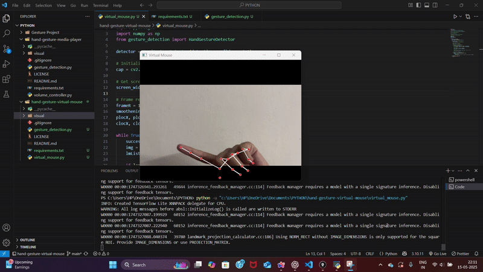

# 🖱️ Hand Gesture Virtual Mouse

Control your mouse cursor using hand gestures via webcam using OpenCV, MediaPipe, and PyAutoGUI.

# 🖱️ Hand Gesture Virtual Mouse

Control your mouse cursor using hand gestures via webcam using OpenCV, MediaPipe, and PyAutoGUI.

## 📦 Tech Stack
- Python
- OpenCV
- MediaPipe
- NumPy
- PyAutoGUI

## 🛠️ How It Works
- Detects hand using MediaPipe
- Tracks index and middle finger positions
- Moves mouse using index finger location
- Performs click when index and middle fingertips come close

# DEMO


## 🚀 How to Run
```bash
pip install -r requirements.txt
python virtual_mouse.py
